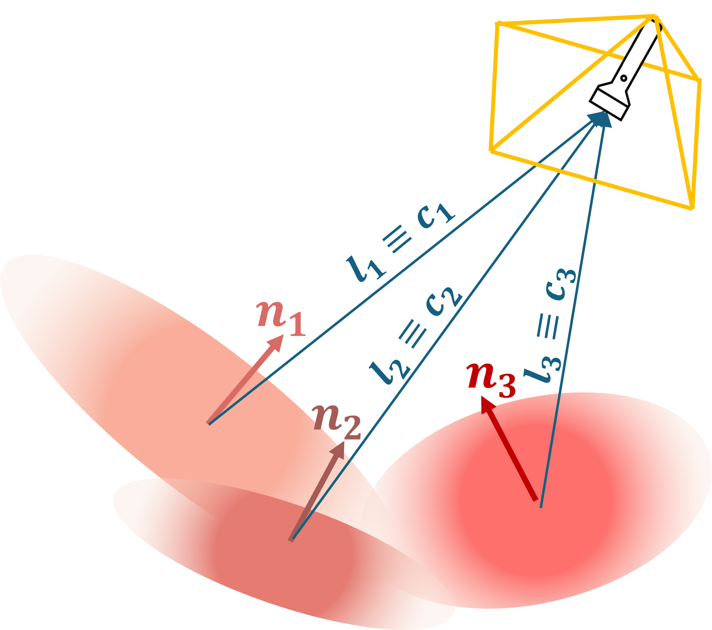

# LumenGSLAM: Online physically based rendering with Gaussian Splatting for robust endoscopic reconstruction and tracking


---

## Overview 🩺

LumenGSLAM is an online visual SLAM framework for photorealistic 3D reconstruction and robust tracking from endoscopic video. It combines a 3D Gaussian Splatting scene representation with explicit Physically Based Rendering (PBR) to produce anatomically faithful maps and realistic relighting while operating online at interactive rates, performing joint estimation of camera pose and dense scene reconstruction through a Gaussian-coupled keypoint tracking module based on SuperPoint and LightGlue for robust localization under rapid motion and variable lighting.

<p align="center">
    
</p>

---

## PBR light decoupling 💡


<table align="center"  style="border-collapse: collapse; border: none;">
  <tr>
    <td align="center"><b>PBR modeling</b></td>
    <td align="center"><b>Base Color</b></td>
    <td align="center"><b>Diffuse Light</b></td>
    <td align="center"><b>Full PBR</b></td>
  </tr>
  <tr>
    <td align="center"></td>
    <td align="center"></td>
    <td align="center"></td>
    <td align="center"></td>
  </tr>
  
</table>

---


## 3D reconstruction 🏗️


<table align="center"  style="border-collapse: collapse; border: none;">
  <tr>
    <td align="center"><b>Ground-Truth</b></td>
    <td align="center"><b>LumenGSLAM</b></td>
    
  </tr>
  <tr>
    <td align="center"></td>
    <td align="center"></td>
  </tr>
  
</table>

---

## Getting Started 🚀
ensure to have the following dependancies:
* Python 3.10
* CUDA 12.4 with NVCC compiler

Mind that for different CUDA versions, the installation of PyTorch and CUDA-based dependancies might differ. Please refer to the official [PyTorch installation guide](https://pytorch.org/get-started/locally/) for more details.


**1. Clone the repository:**
```
git clone https://github.com/FrancescoLeni/LumenGSLAM.git
cd LumenGSLAM
```
**2. Create the conda environment:**
```
conda create -n LumenGSLAM python=3.10 pip # Recommended 
conda activate LumenGSLAM
```


**3. Install dependancies:**
```
pip install torch==2.6.0 torchvision==0.21.0 torchaudio==2.6.0 --index-url https://download.pytorch.org/whl/cu124
pip install -r requirements.txt
```

---

## Dataset 📂

LumenGSLAM is evaluated on two public endoscopic datasets: **C3VD** and **SCARED**.

- **C3VD** is used with the preprocessing pipeline from [EndoGSLAM](https://github.com/Loping151/EndoGSLAM.git) and can be downloaded from their repository.  
- **SCARED** is preprocessed using this [Toolkit](https://github.com/dimitrisPs/scared_toolkit.git) and depth-maps are further densified. The processed data are available [HERE](PLACE_YOUR_LINK_HERE).
- pose files are expected in C3VD format (row major ordered 4x4 c2w matrices in cv2 convention).

Each dataset is organized in the following structure and placed in a folder named `datasets` in the root directory:
```
Dataset/
├── Sequence_1/
│ ├── color/
│ │ ├── 0000.png
│ │ ├── 0001.png
│ │ └── ...
│ ├── depth/
│ │ ├── 0000.tiff
│ │ ├── 0001.tiff
│ │ └── ...
│ └── pose.txt
├── Sequence_2/
│ └── ...
```

---
## Running LumenGSLAM ▶️
To run and evaluate LumenGSLAM on a specific sequence, use the following command (here for cecum_t1_b on C3VD):

```
python train.py --train_config configs/C3VD_config.json --dataset_config C3VD/cecum_t1_b.json --tracking
```

To evaluate a reconstuction and save renders, use the following command:
```
python eval.py --gaussian_model <path_to_gaussian_scene> --dataset_config <path_to_dataset_config>
```

Note that '--datasert_config' in eval.py is used to load camera intrinsics and images for metrics computing. 
Potentially, one could also provide a different trajectory in the form of a new .txt file and use it to render new images passing it via '--pose_file' flag.
Add '--use_tracked_pose' if you want to use the tracked poses saved during training in the saved parameters.
